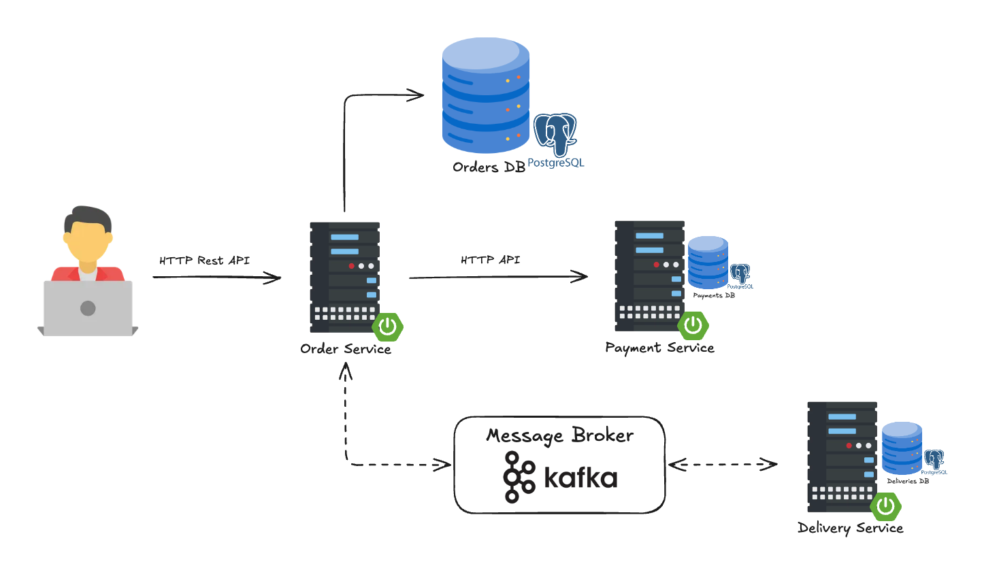

# 🍔 Mini Bolt Food – Microservices Demo

> **Bolt Food on a really small budget**  
> A simplified food delivery system built to demonstrate microservices architecture, synchronous and asynchronous communication, and real-world backend patterns.

This project is a **deliberately simplified backend implementation** inspired by food delivery platforms like **Bolt Food / Uber Eats / Wolt**.  
Its main goal is **not** to replicate full production complexity, but to **showcase architecture design, service boundaries, communication patterns, and clean backend design**.

---

## 🧩 Architecture Overview

The system is composed of **three independent microservices**, each owning its own data and responsibility:

- **Order Service** – core orchestrator, entry point for clients
- **Payment Service** – synchronous payment processing
- **Delivery Service** – asynchronous delivery assignment

Communication is intentionally split into:
- **Synchronous HTTP (REST)** – for payment processing
- **Asynchronous Kafka events** – for delivery lifecycle

📌 **Architecture diagram:**


*High-level overview of microservices communication and data ownership.*

---

## 🏗️ High-Level Flow

1. Client creates a new order via **Order Service**
2. Order is stored and marked as `PENDING_PAYMENT`
3. Client triggers payment:
    - Order Service synchronously calls **Payment Service** via HTTP
4. After successful payment:
    - Order Service publishes `OrderPaidEvent` to Kafka
5. **Delivery Service** consumes the event:
    - assigns a courier
    - calculates ETA (simulated)
    - publishes `DeliveryAssignedEvent`
6. **Order Service** consumes delivery assignment
7. Client confirms delivery → order is closed

> 💡 Payment processing and courier assignment are **illustrative simulations**, not real-world algorithms.

---

## 🧠 Services Description

### 🟢 Order Service (Core / Orchestrator)
- Main entry point for clients (FE or other BE systems)
- Manages order lifecycle and state transitions
- Coordinates communication with other services
- Publishes and consumes Kafka events

### 💳 Payment Service
- Processes payments synchronously via REST
- Stores payment data
- Simulates different payment outcomes
- Designed to be **idempotent** (one payment per order)

### 🚴 Delivery Service
- Fully event-driven
- Reacts to `OrderPaidEvent`
- Assigns courier and ETA
- Publishes `DeliveryAssignedEvent`

Each service:
- owns its **own database schema**
- uses **Flyway migrations**
- is independently deployable

---

## 🔌 API Endpoints (Order Service)

### Create Order
```http
POST /api/v1/orders
```
- Creates a new order with items.
- Returns order in PENDING_PAYMENT state.

### Get Order Details
```http
GET /api/v1/orders/{id}
```
- Returns order details including items and current status.

### Pay Order
```http
POST /api/v1/orders/{id}/pay
```
- Processes payment using selected method.
- Triggers delivery initialization via Kafka event.

### Confirm Delivery
```http
POST /api/v1/orders/{id}/delivery
```
- Finalizes the order after successful delivery.

---

## 📚 API Documentation

Each microservice exposes Swagger UI on its default port:
```http
http://localhost:{port}/swagger-ui.html
```

---

## 🐳 Running the Whole System (Demo Mode)

The entire system **(PostgreSQL, Kafka, and all microservices)** can be built and started using Docker:
```bash
docker compose -f docker-compose.demo.yaml up --build
```
or just run a **docker-compose.demo.yaml** file directly from the IDE (Intellij IDEA Ultimate).

This will:
- build all microservice images
- start PostgreSQL with multiple databases
- start Kafka broker
- start all services fully wired together

Perfect for **demo, testing, or architecture review.**

---

## 🛠️ Tech Stack

- Java 21
- Spring Boot 4
- Spring Data JPA
- Spring Kafka
- PostgreSQL
- Flyway
- Apache Kafka
- Docker & Docker Compose
- Gradle (multi-module monorepo)
- MapStruct
- Swagger / OpenApi

---

## ⚠️ Disclaimer

This project is **intentionally simplified** and does not aim to fully replicate a real-world food delivery platform.

Notable simplifications include:

- no authentication or authorization
- no real payment gateway integration
- no advanced courier assignment or routing algorithms
- simplified domain model and business rules

The primary focus of this project is on:

> **microservices architecture, communication patterns, service boundaries, data ownership, and clean backend design**

The goal is to demonstrate *how* such a system could be structured rather than to solve all production-level concerns.

---

## 🎯 Why This Project Exists

This project was created as:

- a **portfolio / CV showcase**
- a practical exercise in **microservices architecture**
- a demonstration of **real-world backend patterns** without unnecessary enterprise complexity

It highlights:

- synchronous vs asynchronous communication trade-offs
- event-driven workflows using Kafka
- service autonomy and database ownership
- clean layering and responsibility separation

And yes — it is **Bolt Food, but on a really small budget** 😄
